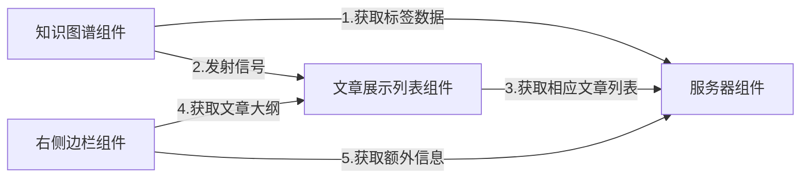

## BlogPage
### 基本功能
实现个人知识图谱的构建和个人博客的展示以及查找
- [ ] 根据后台的博客文章标签数据构建知识图谱在前端展示，前端使用D3.js,后端设计合理的标签分类列表，并可以动态编辑。
- [ ] 通过点击知识图谱节点，博客文章列表动态变化为相应标签的列表
- [ ] 寻找一种优雅的实现这种模式的UI
- [ ] 实现一个侧边栏展示文章的目录导航和架构，打赏页面以及文章推荐等额外信息

### 基本组件及关系

### 数据库表设计

Blog表

Tag表

